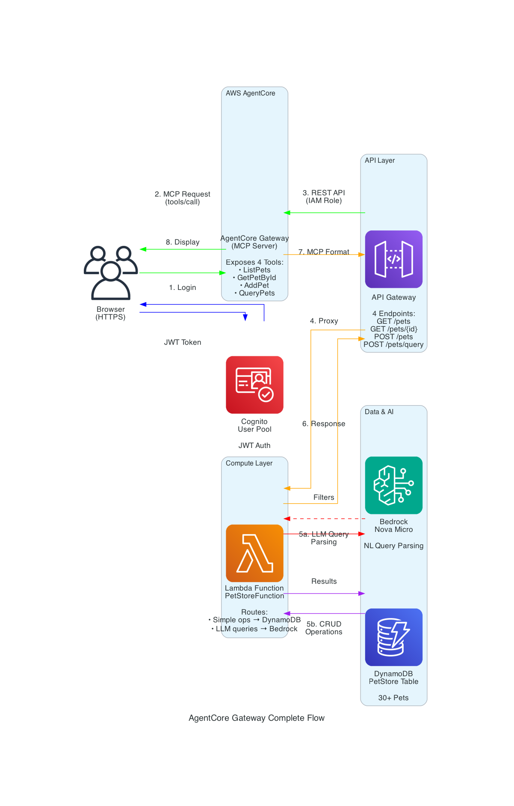
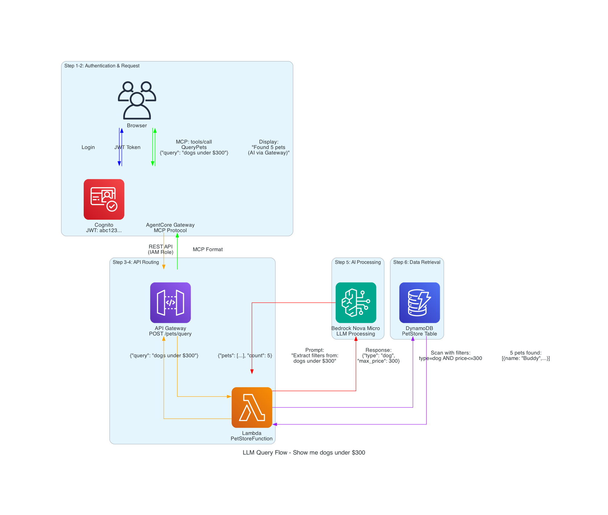
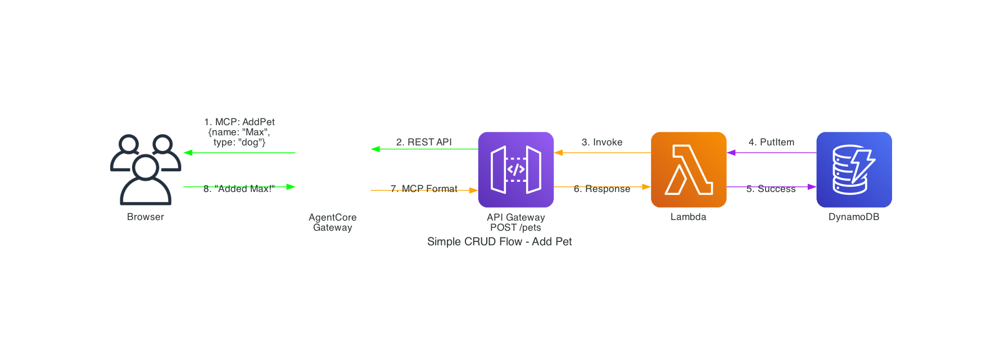

# AgentCore Gateway + API Gateway + Bedrock Integration Demo

🐾 **AI-Powered Pet Store Chatbot** - A production-ready demonstration of AWS AgentCore Gateway integration with API Gateway, Lambda, DynamoDB, and Amazon Bedrock for natural language processing.

## 🌐 Live Demo

**🎉 Try it now:** https://petstore.cloudopsinsights.com

**Login credentials:**
- Username: `testuser`
- Password: `MySecurePass123!`

## 🎯 What We Built

A conversational AI chatbot that demonstrates:

1. **AgentCore Gateway Integration** - MCP protocol for tool exposure
2. **LLM-Powered Natural Language** - Amazon Bedrock (Nova Micro) for query understanding
3. **Full CRUD Operations** - Via conversational interface
4. **Secure Authentication** - AWS Cognito with JWT tokens
5. **Complete Observability** - CloudWatch logs showing full request flow
6. **Production HTTPS** - AWS Amplify with custom domain and free SSL

---

## 🏗️ Complete Architecture

### High-Level Flow



### Architecture Overview

```
┌─────────────────────────────────────────────────────────────────┐
│                    USER BROWSER (HTTPS)                          │
│              https://petstore.cloudopsinsights.com               │
│                  (petstore-chat-secure.html)                     │
└────────────────────────────┬────────────────────────────────────┘
                             │
                             │ HTTPS (Free SSL via Amplify)
                             ▼
┌─────────────────────────────────────────────────────────────────┐
│                      AWS AMPLIFY                                 │
│                  (Hosting + CI/CD)                               │
│              App ID: d1du8jz8xbjmnh                              │
│              Auto-deploy on git push                             │
└────────────────────────────┬────────────────────────────────────┘
                             │
```
┌─────────────────────────────────────────────────────────────────┐
│ 1. BROWSER (Frontend)                                           │
│    https://petstore.cloudopsinsights.com                        │
│    - User types: "Show me dogs under $300"                     │
│    - Sends MCP request to AgentCore Gateway                    │
└────────────────────────┬────────────────────────────────────────┘
                         │
                         │ MCP Protocol (tools/call)
                         │ Authorization: Bearer <JWT>
                         ▼
┌─────────────────────────────────────────────────────────────────┐
│ 2. AGENTCORE GATEWAY (MCP Server)                               │
│    Gateway ID: petstoregateway-remqjziohl                       │
│                                                                  │
│    Exposes 4 MCP Tools:                                         │
│    • PetStoreTarget___ListPets                                  │
│    • PetStoreTarget___GetPetById                                │
│    • PetStoreTarget___AddPet                                    │
│    • PetStoreTarget___QueryPets                                 │
│                                                                  │
│    - Validates JWT token from Cognito                           │
│    - Routes to API Gateway using IAM role                       │
└────────────────────────┬────────────────────────────────────────┘
                         │
                         │ HTTPS REST API (IAM Role)
                         ▼
┌─────────────────────────────────────────────────────────────────┐
│ 3. API GATEWAY (REST API)                                       │
│    ID: 66gd6g08ie                                               │
│                                                                  │
│    Endpoints:                                                    │
│    • GET  /pets          → ListPets                            │
│    • GET  /pets/{id}     → GetPetById                          │
│    • POST /pets          → AddPet                              │
│    • POST /pets/query    → QueryPets (LLM-powered)            │
│                                                                  │
│    - No auth required (trusts AgentCore Gateway IAM role)      │
└────────────────────────┬────────────────────────────────────────┘
                         │
                         │ Lambda Proxy Integration
                         ▼
┌─────────────────────────────────────────────────────────────────┐
│ 4. LAMBDA FUNCTION (PetStoreFunction)                           │
│                                                                  │
│    For QueryPets endpoint:                                      │
│    1. Receives: {"query": "Show me dogs under $300"}          │
│    2. Calls Bedrock Nova Micro:                                │
│       "Extract filters from this query"                        │
│    3. Bedrock returns: {"type": "dog", "max_price": 300}      │
│    4. Queries DynamoDB with filters                            │
│    5. Returns matching pets                                     │
│                                                                  │
│    For other endpoints:                                         │
│    - Direct DynamoDB operations (no Bedrock)                   │
└────────────────────────┬────────────────────────────────────────┘
                         │
                         ├──────────────┐
                         │              │
                         ▼              ▼
              ┌──────────────┐  ┌──────────────┐
              │ 5a. BEDROCK  │  │ 5b. DYNAMODB │
              │  Nova Micro  │  │  PetStore    │
              │              │  │   Table      │
              │ (LLM for     │  │              │
              │  query       │  │ (Pet data:   │
              │  parsing)    │  │  30+ pets)   │
              └──────────────┘  └──────────────┘
```

### 🔄 Complete Request Flow

#### Example: "Show me dogs under $300"

**Step 1: Browser → AgentCore Gateway (MCP)**
```javascript
POST https://petstoregateway-xxx.amazonaws.com/mcp
{
  "jsonrpc": "2.0",
  "method": "tools/call",
  "params": {
    "name": "PetStoreTarget___QueryPets",
    "arguments": {"query": "Show me dogs under $300"}
  }
}
```

**Step 2: AgentCore Gateway → API Gateway**
- Validates JWT token
- Assumes IAM role
- Maps MCP tool to REST endpoint
```
POST https://66gd6g08ie.execute-api.us-east-1.amazonaws.com/prod/pets/query
{"query": "Show me dogs under $300"}
```

**Step 3: API Gateway → Lambda**
- Routes to Lambda function
- Passes request body

**Step 4: Lambda → Bedrock**
```python
# Lambda calls Bedrock
response = bedrock.converse(
    modelId="us.amazon.nova-micro-v1:0",
    messages=[{
        "role": "user",
        "content": "Extract filters from: Show me dogs under $300"
    }]
)
# Bedrock responds: {"type": "dog", "max_price": 300}
```

**Step 5: Lambda → DynamoDB**
```python
# Query DynamoDB with extracted filters
response = table.scan(
    FilterExpression="attribute_type = :type AND price <= :max_price",
    ExpressionAttributeValues={
        ":type": "dog",
        ":max_price": 300
    }
)
# Returns: 5 matching pets
```

**Step 6-8: Response Flow**
```
Lambda → API Gateway → AgentCore Gateway → Browser
{"pets": [...], "count": 5}
```

Browser displays: **"Found 5 pets (🤖 AI via AgentCore Gateway → Bedrock)"**

---

### 📊 Flow Diagrams

#### LLM Query Flow


#### Simple CRUD Flow


---

## 💡 Why This Architecture?

### 1. **AgentCore Gateway as Central Hub**
- **Standardized Interface**: MCP protocol for all operations
- **Security**: Single authentication point with JWT validation
- **Tool Abstraction**: API endpoints exposed as callable tools
- **Observability**: Centralized logging and monitoring

### 2. **Bedrock in Lambda (Not Browser)**
- **Cost Control**: Prevent unlimited API calls from browser
- **Security**: API keys never exposed in frontend code
- **Rate Limiting**: Control Bedrock usage per user/session
- **Business Logic**: Complex query parsing on backend

### 3. **Hybrid Approach**
- **Simple Operations**: Direct DynamoDB (list, add, get)
- **LLM Queries**: Bedrock for natural language understanding
- **Performance**: Skip Bedrock when not needed (75ms vs 520ms)

### 4. **Production Ready**
- **HTTPS**: Free SSL via AWS Amplify
- **Authentication**: Cognito with JWT tokens
- **CORS**: Proper cross-origin configuration
- **Error Handling**: Graceful fallbacks and user feedback

---

## 💡 Technical Innovation
- **LLM Tool Calling** - Bedrock extracts structured parameters from natural language
- **Hybrid Approach** - LLM for complex queries, fallback for simple ones
- **MCP Protocol** - AgentCore Gateway exposes APIs as standardized tools
- **Complete Observability** - CloudWatch logs show entire request flow
- **CI/CD Built-in** - Auto-deploy on git push via Amplify

## 🚀 Quick Start

### Prerequisites
- AWS Account
- AWS CLI configured
- Python 3.8+
- Git

### 1. Clone Repository
```bash
git clone https://github.com/catchmeraman/agentcore-api-gateway-integration-bedrock.git
cd agentcore-api-gateway-integration-bedrock
```

### 2. Deploy Infrastructure
```bash
# Run automated deployment
./scripts/deploy.sh
```

This creates:
- DynamoDB table (PetStore)
- Lambda function with Bedrock integration
- IAM roles and policies
- S3 bucket for frontend

### 3. Deploy to Amplify (HTTPS)

**Option A: Via Console (Recommended)**
1. Go to [AWS Amplify Console](https://console.aws.amazon.com/amplify)
2. Click "New app" → "Host web app"
3. Connect GitHub repository
4. Deploy!

**Option B: Via CLI**
```bash
npm install -g @aws-amplify/cli
amplify init
amplify add hosting
amplify publish
```

See [AMPLIFY_MANUAL_DEPLOY.md](docs/AMPLIFY_MANUAL_DEPLOY.md) for detailed steps.

### 4. Test
```bash
# Open in browser
open https://petstore.cloudopsinsights.com

# Login with test user
Username: testuser
Password: MySecurePass123!

# Try queries:
# - "List all pets"
# - "Show me expensive dogs"
# - "Cheap cats under $200"
# - "Add a dog named Max, breed: Golden Retriever, age: 3, price: $500"
```

## 📊 Use Cases

### 1. Natural Language Queries
**User:** "Show me expensive dogs under $700"

**What Happens:**
1. Frontend sends raw query to `/pets/query`
2. Lambda calls Bedrock Converse API
3. LLM understands intent and calls `filter_pets` tool:
   ```json
   {
     "type_filter": "dog",
     "max_price": 700,
     "sort_by": "price_desc"
   }
   ```
4. Lambda applies filters to DynamoDB data
5. Returns sorted results with "🤖 AI-powered" badge

**Cost:** ~$0.0001 per query

### 2. Simple CRUD Operations
**User:** "Add a dog named Max, breed: Golden Retriever, age: 3, price: $500"

**What Happens:**
1. Frontend regex extracts parameters
2. Direct POST to `/pets` endpoint
3. Lambda writes to DynamoDB
4. Returns success confirmation

**Cost:** Free (no LLM call)

### 3. List Operations
**User:** "List all pets"

**What Happens:**
1. Frontend sends to `/pets/query`
2. Lambda uses fallback (no LLM needed)
3. DynamoDB scan returns all pets
4. Displays results

**Cost:** Free (fallback mode)

## 🔍 How It Works

### LLM Tool Calling Flow

```python
# Lambda calls Bedrock with tool definition
response = bedrock.converse(
    modelId="us.amazon.nova-micro-v1:0",
    messages=[{"role": "user", "content": [{"text": query}]}],
    toolConfig={
        "tools": [{
            "toolSpec": {
                "name": "filter_pets",
                "description": "Filter and sort pets",
                "inputSchema": {
                    "type": "object",
                    "properties": {
                        "type_filter": {"type": "string"},
                        "max_price": {"type": "number"},
                        "min_price": {"type": "number"},
                        "sort_by": {"type": "string"}
                    }
                }
            }
        }]
    }
)

# LLM returns structured parameters
# Lambda applies filters to DynamoDB results
```

## 📁 Repository Structure

```
.
├── README.md                          # This file
├── PROJECT_SUMMARY.md                 # Executive summary
├── docs/
│   ├── ARCHITECTURE.md                # Detailed architecture
│   ├── EXAMPLE_LOGS.md                # Actual request logs
│   ├── COST_ANALYSIS.md               # Cost breakdown
│   ├── QUICK_START.md                 # 15-min setup guide
│   ├── HTTPS_SETUP.md                 # HTTPS configuration
│   ├── AMPLIFY_MANUAL_DEPLOY.md       # Amplify deployment
│   ├── COMPLETE_FLOW_WITH_LOGS.md     # Request flow
│   ├── DEMO_QUESTIONS.md              # What you can ask
│   └── SECURITY_IMPROVEMENTS.md       # Security best practices
├── lambda/
│   └── lambda_function.py             # Main Lambda code
├── frontend/
│   └── petstore-chat-secure.html      # Browser interface
├── iam/
│   ├── lambda-trust-policy.json       # Lambda execution role
│   ├── bedrock-policy.json            # Bedrock permissions
│   └── dynamodb-policy.json           # DynamoDB access
└── scripts/
    ├── deploy.sh                      # Automated deployment
    ├── setup-amplify.sh               # Amplify setup
    └── setup-https-cloudfront.sh      # CloudFront HTTPS
```

## 🎓 What You'll Learn

1. **AgentCore Gateway** - How to expose APIs as MCP tools
2. **Bedrock Integration** - LLM tool calling for parameter extraction
3. **Serverless Architecture** - Lambda + API Gateway + DynamoDB
4. **Secure Authentication** - Cognito without hardcoded credentials
5. **Cost Optimization** - Using cheapest models with fallback strategies
6. **Observability** - CloudWatch logs for debugging and monitoring
7. **HTTPS Deployment** - Free SSL with AWS Amplify
8. **CI/CD** - Auto-deploy on git push

## 💰 Cost Analysis

### Per Query Costs
- **LLM Query (complex):** ~$0.0001 (Nova Micro)
- **Simple Query (fallback):** $0.00 (no LLM call)
- **Lambda Execution:** ~$0.0000002 per request
- **DynamoDB Read:** ~$0.00000025 per item
- **API Gateway:** ~$0.0000035 per request
- **Amplify Hosting:** $0.15 per GB served

### Monthly Estimate (1000 queries)
- **LLM Calls (50%):** $0.05
- **Lambda:** $0.0002
- **DynamoDB:** $0.0003
- **API Gateway:** $0.0035
- **Amplify:** ~$0.50
- **Total:** ~$0.56/month

**Essentially minimal cost for a production app!**

## 🔒 Security Features

1. **No Hardcoded Credentials** - User enters credentials at login
2. **JWT Authentication** - Cognito tokens for API access
3. **IAM Roles** - Least privilege access for Lambda
4. **CORS Configuration** - Proper cross-origin handling
5. **Input Validation** - Regex and type checking
6. **HTTPS Only** - Free SSL via Amplify
7. **Auto-Deploy** - Secure CI/CD pipeline

### Production Recommendations
- ✅ Use Cognito Hosted UI
- ✅ Enable HTTPS (done via Amplify)
- ✅ Add rate limiting
- ✅ Implement request signing
- ✅ Enable CloudWatch alarms

## 📈 Monitoring & Debugging

### CloudWatch Logs
```bash
# Lambda logs
aws logs tail /aws/lambda/PetStoreFunction --follow

# API Gateway logs (enable first)
aws logs tail /aws/apigateway/66gd6g08ie/prod --follow
```

### Key Metrics
- Lambda duration: ~600ms average
- LLM call: ~400ms
- DynamoDB query: ~50ms
- Cold start: ~2s (first request)

## 🧪 Testing

### Manual Testing
```bash
# Test LLM endpoint
curl -X POST https://66gd6g08ie.execute-api.us-east-1.amazonaws.com/prod/pets/query \
  -H "Content-Type: application/json" \
  -d '{"query":"expensive dogs under 700"}'

# Test add pet
curl -X POST https://66gd6g08ie.execute-api.us-east-1.amazonaws.com/prod/pets \
  -H "Content-Type: application/json" \
  -d '{"name":"Max","type":"dog","breed":"Labrador","age":3,"price":500}'
```

## 🤝 Contributing

Contributions welcome! Please:
1. Fork the repository
2. Create a feature branch
3. Make your changes
4. Submit a pull request

## 📝 License

MIT License - see LICENSE file for details

## 🙏 Acknowledgments

- AWS Bedrock team for Nova Micro model
- AWS AgentCore team for MCP gateway
- AWS Amplify team for seamless HTTPS deployment
- Community feedback and testing

## 📞 Support

- **Live Demo:** https://petstore.cloudopsinsights.com
- **Issues:** https://github.com/catchmeraman/agentcore-api-gateway-integration-bedrock/issues
- **Discussions:** https://github.com/catchmeraman/agentcore-api-gateway-integration-bedrock/discussions

## 🎯 Next Steps

1. **Try the Demo** - https://petstore.cloudopsinsights.com
2. **Read the Docs** - Understand the architecture
3. **Customize** - Adapt for your use case
4. **Deploy** - Follow the Quick Start guide
5. **Share** - Star the repo and spread the word!

---

**Built with ❤️ using AWS Serverless + AI**

**Live Demo:** https://petstore.cloudopsinsights.com
**Cost:** ~$0.56/month for 1000 queries
**Setup Time:** 15 minutes

🎉 **Production-ready AI chatbot with HTTPS and auto-deploy!**
